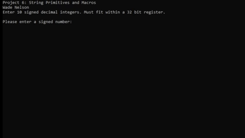

# AssemblyStringParser
Assembly string parser project.
Gets string input from the user, converts the string data into ascii, processes the data, converts the data back into a string, and presents the processed data back to the user

